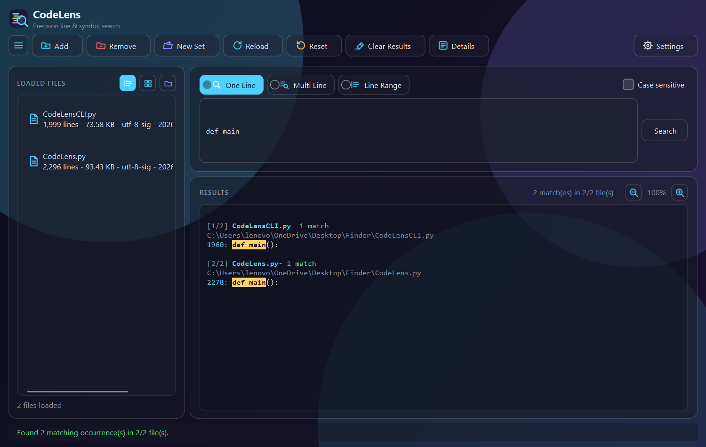
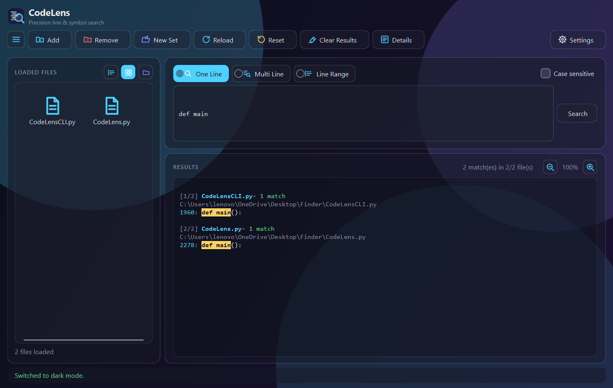
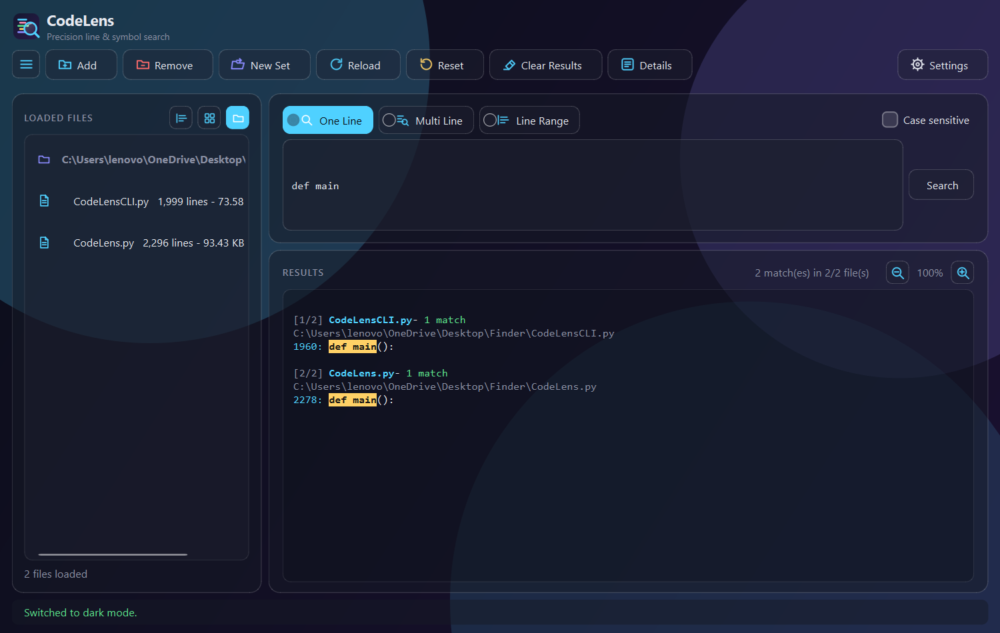
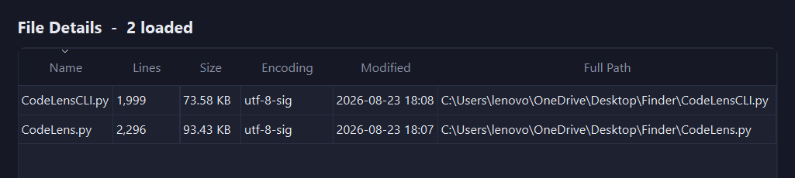
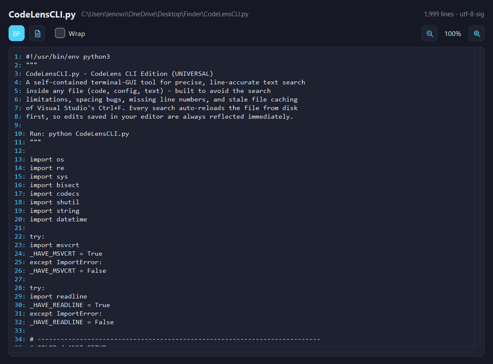
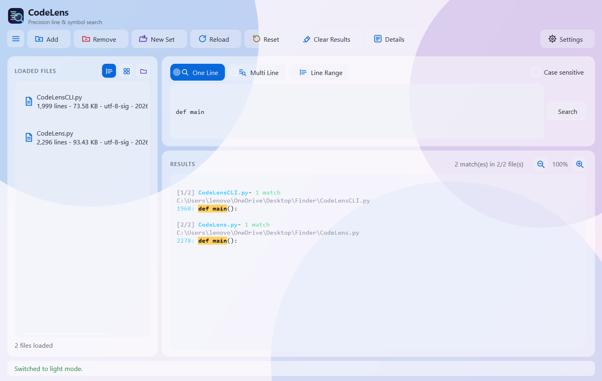

<div align="center">


# CodeLens

**Find the exact line, every time.**

Precision line & symbol search for any text file — a self-contained terminal tool
and a glassy PySide6 desktop app, sharing one search engine.

<sub>by <strong>Robin Gupta</strong></sub>

[](https://claude.com/claude-code)
[](https://www.python.org/)
[](https://pypi.org/project/PySide6/)

<br>



</div>

<br>

CodeLens exists to avoid the search limitations, spacing bugs, missing line numbers, and
stale-file caching of editor "Find" boxes (Visual Studio's Ctrl+F was the original pain point).
Every search auto-reloads the file from disk first, so edits saved elsewhere are always
reflected immediately.

<br>

## Two front-ends, one engine

<table>
<tr>
<td width="50%" valign="top">

### 🖥️ [`CodeLensCLI.py`](CodeLensCLI.py)
**Terminal edition**

```bash
python CodeLensCLI.py
```

Standard library only — `colorama` is used if
present, otherwise raw ANSI. Tab-completion,
paste-and-go file loading, recursive filename
search across the current directory or the
whole system.

</td>
<td width="50%" valign="top">

### 🪟 [`CodeLens.py`](CodeLens.py)
**Desktop edition**

```bash
python CodeLens.py
```

Needs one package — `pip install PySide6`.
Glassmorphism UI, custom accent colors, drag &
drop, resizable panes, live preview, and a full
details table.

</td>
</tr>
</table>

`CodeLens.py` imports its search logic directly from `CodeLensCLI.py`
(`core.build_flexible_pattern`, `core._find_matches`, `core.add_file_to_state`, etc.) — there is
exactly **one** implementation of the actual search behavior, not two copies that could drift
apart.

<br>

## Search modes

Every loaded file is searched at once; results are grouped per file with match counts, and each
search silently reloads any file that changed on disk since it was opened.

| Mode | What it does |
|---|---|
| **One Line** | Exact literal match on a single line, optional case sensitivity. |
| **Multi Line** | Whitespace/blank-line-insensitive match for a pasted snippet — falls back automatically to a comment-stripped comparison if the plain match finds nothing. |
| **Line Range** | Show a specific `start-end` (or single-line) range from one loaded file, chunked for very large ranges. |

<br>

## The desktop app, in detail

<table>
<tr>
<td width="50%" valign="top">
<br>
<sub align="center"><b>Grid view</b> — files as icon tiles.</sub>
</td>
<td width="50%" valign="top">
<br>
<sub><b>Group by folder</b> — files sharing a directory collapse into one section.</sub>
</td>
</tr>
</table>

- **Hamburger menu** (top-left) hides/shows the file list panel, remembering its width.
- **Three list views**: detail list (name, lines, size, encoding, modified), grid, or grouped by folder — toggle above the list.
- **Drag & drop**: drop files anywhere on the window from Explorer to add them.
- **Resizable panes**: search and results split like a file explorer — drag the divider to resize either one.
- **Details button** opens a separate sortable table with full metadata for every loaded file.

<div align="center">

<br><sub>The Details window — sortable, one row per loaded file.</sub>
</div>

<br>

Double-click any file to open it in a resizable **Preview** window — a Formatted view (line
numbers) and a Raw view (exact plain text), independent line-wrap, and its own zoom controls:

<div align="center">

</div>

<br>

### Look & feel

- **Glassmorphism** — translucent panels over soft blurred-color blobs, toggleable in Settings (on by default).
- **Dark / Light theme** and a **custom accent color picker** (a hand-drawn glassy swatch grid + hex entry, not the stock OS color dialog), both crossfade when switched.
- **Custom animated dialogs** replace every native message box — frameless, glass-matched, scale-and-fade in/out.
- **Custom checkbox** with a spring-animated checkmark, used in place of the native one.
- The window/brand icon is a single colorful vector — syntax-highlighted "code lines" behind a magnifying lens, not a plain reused search icon.

<div align="center">

<br><sub>The same window, light theme.</sub>
</div>

<br>

## Keyboard shortcuts

Editable live in **Settings → Edit Shortcuts**, and persisted to `shortcuts.json`.

| Action | Default |
|---|---|
| Run Search | <kbd>Ctrl</kbd> + <kbd>Enter</kbd> |
| Add File(s) | <kbd>Alt</kbd> + <kbd>A</kbd> |
| Reload Files | <kbd>Ctrl</kbd> + <kbd>R</kbd> |
| Reset | <kbd>Ctrl</kbd> + <kbd>Shift</kbd> + <kbd>R</kbd> |
| Clear Results | <kbd>Shift</kbd> + <kbd>C</kbd> |
| Toggle Case Sensitive | <kbd>Alt</kbd> + <kbd>S</kbd> |
| Zoom In *(results / preview)* | <kbd>Ctrl</kbd> + <kbd>+</kbd> |
| Zoom Out | <kbd>Ctrl</kbd> + <kbd>-</kbd> |
| Reset Zoom | <kbd>Ctrl</kbd> + <kbd>0</kbd> |

<br>

## Icons

Real vector `.svg` sources live under [`Assets/`](Assets), split by where they're used:

<p>


&nbsp;&nbsp;&nbsp;


</p>

- **`DarkModeIcons/`** / **`LightModeIcons/`** — same filenames in both, palette-matched to each theme. Qt loads these natively via `QIcon` — no rasterizer dependency.
- **`HoverIcons/`** — a single white-on-transparent set used whenever a button's background turns solid (hover/checked), since a themed icon tinted for its resting background disappears against its own hover color.
- **`app_icon.svg`** — the app/window icon.

Accent-role icons (search, multi, lines, info, add, reload, clear, grid) are re-tinted at runtime
to match whichever custom accent color is picked in Settings; danger/warn/secondary icons keep
their fixed semantic color regardless.

<br>

## Requirements

```bash
pip install PySide6
```

`CodeLensCLI.py` alone has no required third-party dependencies (`colorama` is used if present,
otherwise it falls back to raw ANSI codes).

<br>

<details>
<summary><b>Project layout</b></summary>
<br>

```
CodeLensCLI.py      Terminal edition + shared search engine
CodeLens.py         PySide6 desktop edition (imports CodeLensCLI.py's engine)
shortcuts.json      Saved keyboard-shortcut overrides (created on first edit)
Assets/
  DarkModeIcons/    SVG icons, dark theme palette
  LightModeIcons/   SVG icons, light theme palette
  HoverIcons/       SVG icons, white (hover/checked state)
  Screenshots/      README screenshots
  app_icon.svg      Colorful app/window icon
```

</details>

<br>

<div align="center">

<sub>Created by <strong>Robin Gupta</strong> — built collaboratively with <a href="https://claude.com/claude-code">Claude Code</a>.</sub>

</div>
